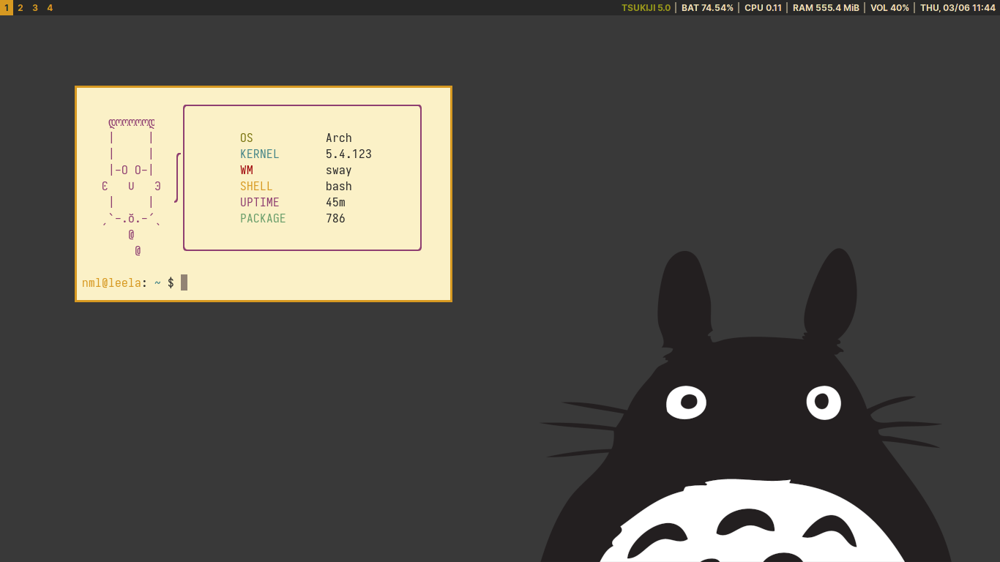

# dotfiles

Distro-agnostic configurations for production tools on GNU/Linux, compatible for a Wayland-based installation.

Color scheme adapted from [Gruvbox](https://github.com/morhetz/gruvbox) with [Inter](https://rsms.me/inter/) and [Iosevka](https://typeof.net/Iosevka/) being UI and monospace fonts respectively. 

## Dependencies
- **bash** — Shell.
- **foot** — Terminal emulator.
- **emacs** — Text editor.
- **sway** — Window manager.
- **qutebrowser** - Web browser.
- **swaylock** — Screen locker.
- **swayidle** — Idle management daemon.
- **swaybar+i3status** — Status bar.
- **j4-menu-desktop+bemenu** — Application launcher.
- **mako** - Notification daemon.
- **lf** - File manager.
- **zathura** - PDF/EPUB/CBZ viewer.
- **newsboat** - RSS reader.
- **grim+slurp** - Screenshot tools.
- **wlsunset** - Gamma adjustments for the wayland compositor.
